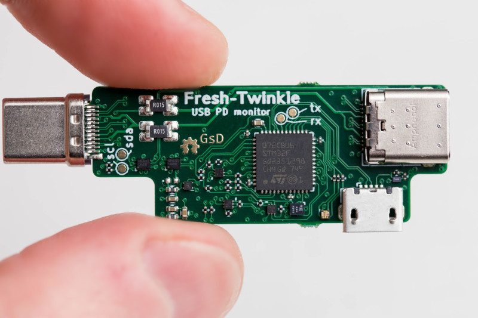

# PD-Sniffer

This project is based off the Twinkie, a Google designed PD sniffer/analyser. [link](https://www.chromium.org/chromium-os/twinkie)

Unfortunately the original designers of the Twinkie designed the hardware with laptop like specifications. As a result the design features a 6L PCB with stacked micro-vias. This makes it expensive to manufacture.

This re-design aims to keep the board specifications within the scope of PCB prototyping services, so it is easier for hobbyists and other open-source contributors to create and build a unit.

## Hardware versions

### v0.1 (FreshTwinkie)
The initial version aims to remain pin compatible with the original design, so firmware can be re-used. The main MCU is swapped from a BGA package to a QFN, and a 4L board construction is used. As a result many BGA devices are still used, as these were un-changed from the original design.

